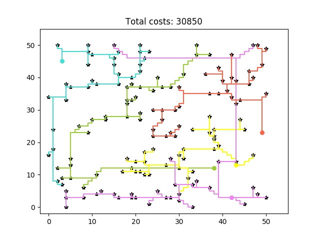
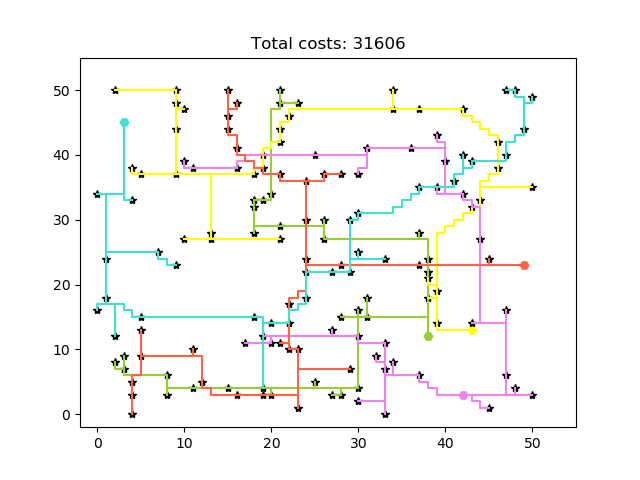
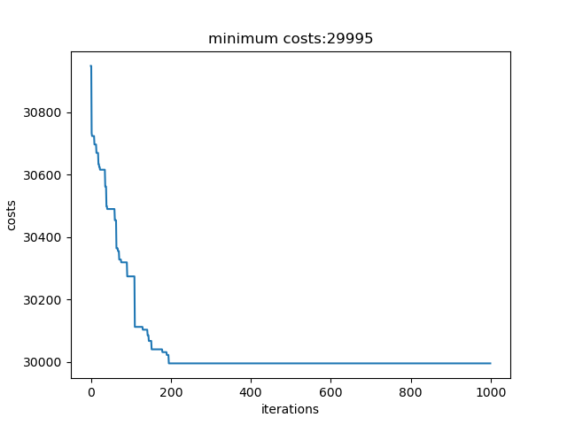
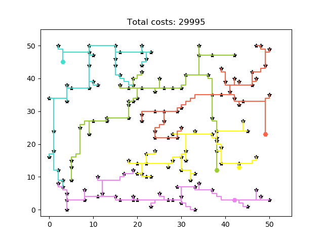
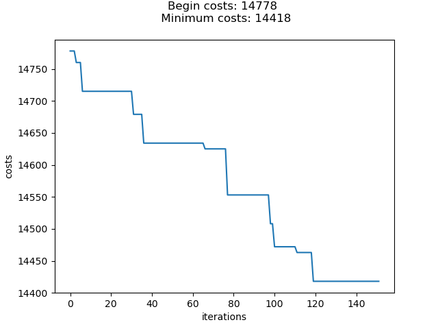
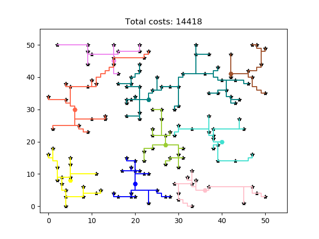
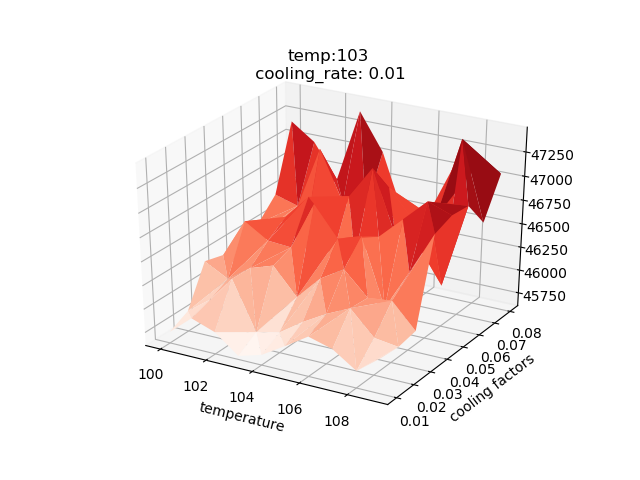

# Smart Grid
 > More and more people are starting to generate their own energy. Often times, they generate more than they can use. The surplus could > be sold back to the energy supplier, however the infrastucture is not build for that. To manage this, batteries should be placed to > store the leftover energy. 

 > To handle this, we are tasked to find an optimum configuration by assigning houses to batteries. 
 > In doing so, we explored the case by finding different ways to construct allocations. In this file, figures 
 > can be found of some of the results. These are not all possible results, however, it gives a good idea of the progress we made.


## Getting Started

### Prerequisites

The codebase is written in its entirety in [Python3.8.1](https://www.python.org/downloads/). Requirements.txt contains all the necessary packages to successfully run the code. These are easily installed with the following instuction:

```
pip install -r requirements.txt
```

### Structure

All the Python scripts are located in the "code" folder. The "data" map contains all the input values. The results are stored in "results" folder.

### Testing

To run the code with the standard configuration use the instruction:

```
python main.py
```
After running main.py, you will be prompted for your desired configuration.
You can choose between a random, greedy, and cluster algorithm for the initialization.
For optimization you can choose between hillclimber (both stochastic and steepest descent), simulated annealing and no optimization.
You can also decided if you want the cables to share a grid segment using prim's algorithm.
Lastly, you can enable battery placement. This configures a placement with three new types of batteries.

## Authors

* Amparo Gilhuis
* Rens Hofstee
* Samy van Stokkum

## Acknowledgments

* StackOverflow
* Minor Programming from the UvA
* Marleen and Julien


### Figures

> Figure 1: "District 1; with greedy and no optimization"


> Figure 2: "District 1; with random and Simulated Annealing


> Figure 3: "District 1; with greedy and HillClimber Steepest Ascent"

> 3a. Costs


> 3b. Grid



> Figure 4: "District 1; with cluster and Simulated Annealing, Shared Lines and Advanced options"

> 4a. Costs


> 4b. Grid


> Figure 5: "Exploration of Simulated Annealing parameters (costs are presented on the Z-axis)."

